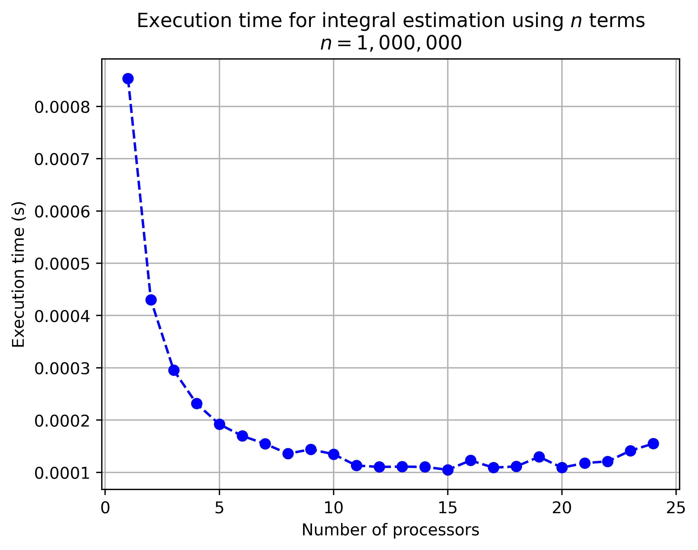
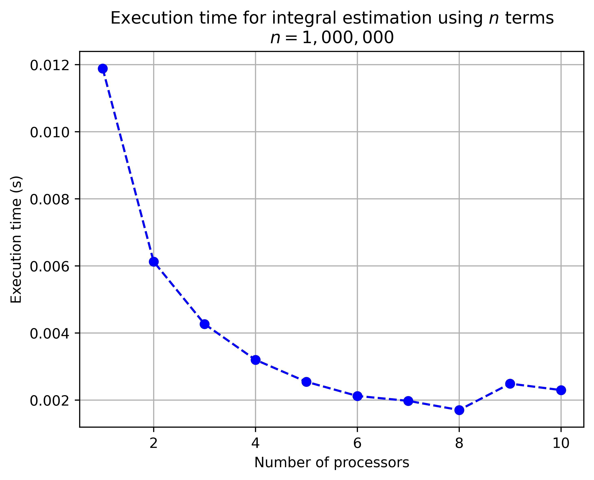
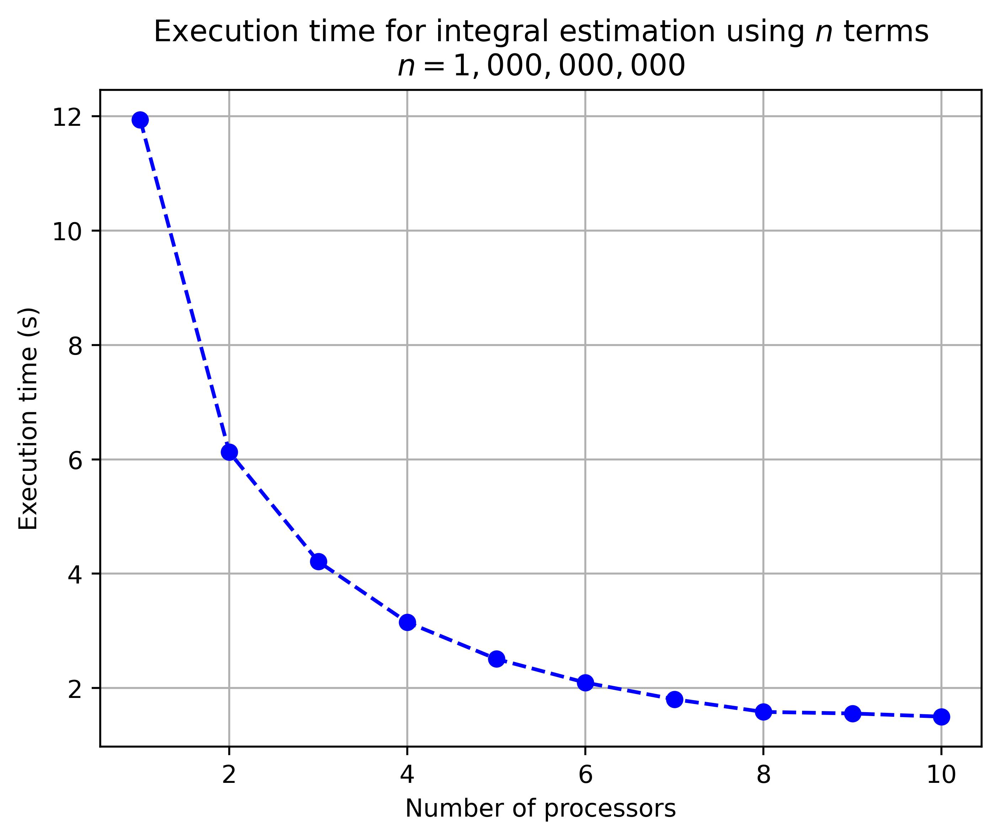

# HW1

CSE-6220 HW1

## Make and run

Run the following to make and run the program `int_calc` with $n=2000$ and $p=8$:

```shell
$ make run n=2000 p=8
```

By default, $n = 1000$ and $p = 4$.

## Compare performance across values of $p$

### Print to standard out

To output to stdout only, without showing or saving a chart, use the `report_stdout.py` script.
This script has no dependencies outside the Python standard library.
It outputs a list of $(p, t)$ tuples, where $p$ is the processor count, and $t$ is the execution time in seconds.

### Create report charts

Create report charts with the `report_chart.py` script, either using the `-i` argument to provide a list of $(p, t)$ tuples, or by executing the program on a series of processor counts.

#### Create report chart based on previous output

Pass the output of a previous `report_stdout.py` run into the `report_chart.py` script via the `-i` argument. For example, here is a chart comparing processor counts $p=[1,2,...24]$ on the PACE cluster:

```shell
python report_chart.py -i "[(1, 0.0008535), (2, 0.0004299), (3, 0.0002954), (4, 0.0002315), (5, 0.0001919), (6, 0.0001698), (7, 0.0001545), (8, 0.0001357), (9, 0.000144), (10, 0.0001347), (11, 0.000113), (12, 0.0001104), (13, 0.0001109), (14, 0.0001104), (15, 0.0001049), (16, 0.0001228), (17, 0.000109), (18, 0.0001113), (19, 0.0001297), (20, 0.000109), (21, 0.0001178), (22, 0.0001209), (23, 0.0001414), (24, 0.000155)]" -o report_chart_n_1M_PACE.jpg
```



#### Execute and export/show report charts

Note: Must have `matplotlib` package installed to create report charts.

Example: Create a report chart with $n=1M$, comparing $p=[1,2,...10]$, and save it to the file `report_chart_n_1M.jpg`:

```shell
$ python report_chart.py -p=10 -n 1000000 -o report_chart_n_1M.jpg
```

_(Note: This run was on a 2021 MacBook Pro using all of its 10 CPU cores. Eight are "performance" cores, and two are "efficiency" cores, so the dip for $p=[9,10]$ is likely due to incorporating the two efficiency cores.)_



Example: Same as above, but with n=1B:

```shell
$ python report_chart.py -p=10 -n 1000000000 -o report_chart_n_1B.jpg
```


